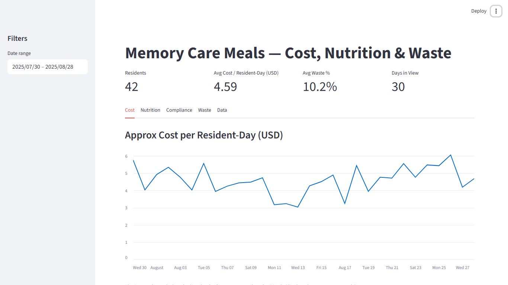
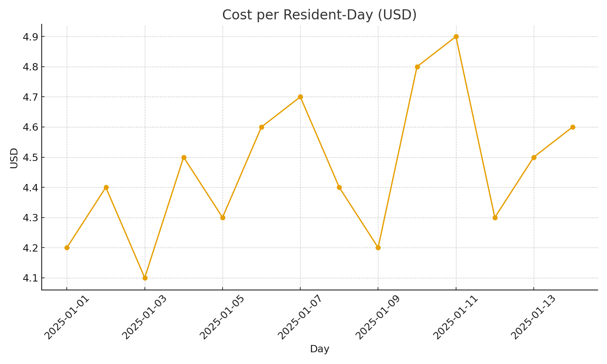
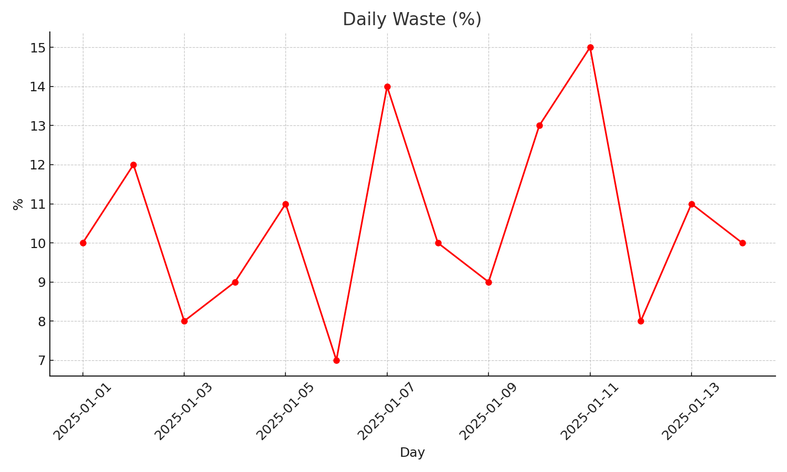

# 🍽️ Memory Care Meals Analytics Dashboard  

  

## 📖 Overview  
This project demonstrates how **data analytics** can support **executive food & beverage leadership** in a residential memory care facility.  
It combines **Python**, **Streamlit**, and **Jupyter** to track:  
- Daily **nutrition compliance**  
- **Cost per resident-day**  
- **Plate waste** (prepared vs. served vs. leftover)  

The result is an **interactive dashboard** for leadership decision-making and a **reproducible project** suitable for portfolio demonstration.  

---

## 🚨 Problem  
Memory care facilities face unique food service challenges:  
- Balancing **nutritional standards** (calories, protein, sodium, etc.) with diverse dietary needs.  
- Monitoring **per-resident food costs** under tight budgets.  
- Reducing **plate waste** while ensuring sufficient preparation.  
- Delivering insights that executives and managers can act on quickly.  

---

## 🛠️ Approach  
- **Synthetic Data Engineering**  
  - Built realistic datasets: residents, recipes, menus, nutrition standards.  
  - Simulated **plate count data** with realistic waste levels (5–15%).  

- **Analysis Pipeline**  
  - Used **Pandas & NumPy** to merge datasets, calculate nutrition totals, and compute waste percentages.  
  - Added robust error handling (missing fields, division by zero).  
  - Produced reproducible outputs (`daily_summary_with_plate_counts.csv`, `daily_checks_with_plate_counts.csv`).  

- **Dashboard**  
  - Interactive **Streamlit app** with:  
    - KPIs (cost per resident-day, waste %, compliance rate).  
    - Line charts for nutrition, cost, and waste.  
    - Compliance checks table with pass/fail indicators.  
    - CSV download buttons for reporting.  

- **Deployment & Version Control**  
  - Reproducible project structure with **virtual environments**.  
  - `requirements.txt` and `requirements_streamlit.txt` for installation.  
  - GitHub integration for professional workflow.  

---

## 📊 Results  
- **Leadership-ready dashboard** for memory care food service.  
- **Visibility into cost & waste trends**, highlighting efficiency opportunities.  
- **Automated compliance tracking** with dietary standards.  
- Strong portfolio example combining **culinary leadership & data science**.  

---

## 🚀 Getting Started  

### 1. Clone the repo  
```bash
git clone https://github.com/<your-username>/memory_care_meals.git
cd memory_care_meals
```

### 2. Create a virtual environment  
```bash
python -m venv .venv
# Windows
.venv\Scripts\activate
# macOS/Linux
source .venv/bin/activate
```

### 3. Install dependencies  
```bash
pip install -r requirements.txt
```

### 4. Generate synthetic plate counts  
```bash
python generate_plate_counts.py
python analyze_plate_counts_fixed.py
```

### 5. Run the Streamlit dashboard  
```bash
pip install -r requirements_streamlit.txt
streamlit run app.py
```

---

## 📂 Project Structure  
```
memory_care_meals/
│
├── residents.csv
├── recipes.csv
├── menu_calendar.csv
├── nutrition_standards_daily.csv
├── plate_counts.csv                # generated
│
├── generate_plate_counts.py        # simulates realistic waste
├── analyze_plate_counts_fixed.py   # robust analysis script
├── analysis_plate_counts_fixed.ipynb # notebook version
│
├── app.py                          # Streamlit dashboard
├── requirements.txt
├── requirements_streamlit.txt
└── README.md
```

---

## 🖼️ Dashboard Features  
- **Cost Tab:** Cost per resident-day (line chart)  
- **Nutrition Tab:** Calories, protein, carbs, fat, sodium, fiber totals  
- **Compliance Tab:** Pass/fail checks vs. daily standards  
- **Waste Tab:** Plate waste % with detailed breakdown  
- **Data Tab:** Downloadable CSVs + data preview  

  
  

---

## 🔮 Future Enhancements  
- Diet-type lens (e.g., diabetic, gluten-free, vegetarian compliance).  
- Forecasting of costs & waste with time-series models.  
- Alert system for days with high waste or compliance failures.  

---

## 📌 Skills Demonstrated  
- Data cleaning & preprocessing (Pandas, NumPy)  
- Visualization (Matplotlib, Streamlit)  
- Reproducible analysis pipelines  
- Executive-facing dashboards & KPIs  
- GitHub project management & documentation  
